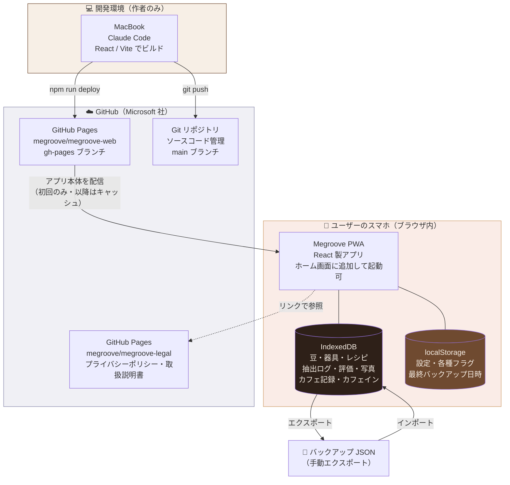

# Megroove システム仕様書

Web版 Megroove の「どこで動き、何を使い、いくらかかっているか」と「何ができるか（機能の全体像）」を
まとめた文書です。技術に詳しくない相手への説明や、将来の自分・別の開発者への引き継ぎを想定しています。

> 本書はコードベース（`package.json` / `vite.config.ts` / `index.html` / `src/`）と突き合わせて確定した内容です
> （2026-08 時点）。構成や機能に変更が生じた際は本書も更新してください。詳細な設計方針は `CLAUDE.md`、
> 現在地は `PROGRESS.md`、今後の計画は `ROADMAP.md` を参照。

---

## 1. ひとことでいうと

Megroove は **「自前のサーバーを持たない Web アプリ」** です。

- アプリ本体（プログラム）は **GitHub Pages** から配信される
- ユーザーの記録は **各自のスマホのブラウザの中** にだけ保存される
- 両者の間でデータのやり取りは発生しない（記録がネットに送られることはない）

「サーバーレス」と呼んでいますが、正確には **アプリを配信するサーバーは存在する（GitHub のもの）／
データを預かるサーバーは存在しない** という状態です。運営者（作者）はサーバーを1台も借りていません。

---

## 2. 主な機能（実装済みの全体像）

日常的にコーヒーを淹れる／飲む行動を詳しく記録・評価し、淹れ方の追求と再現を助けるアプリです。
「開いた瞬間に前回値で埋まっていて、変えたところだけ直して保存」できる**手軽さ最優先**の設計。

### 記録する
- **ブリュー記録（自宅抽出）**: 最小入力（豆＋レシピ＋星評価）で保存でき、前回値が初期表示される。
  詳細（カッピング5軸／器具／総抽出時間・注湯回数／メモ／写真／シーン・飲み方）は折りたたみ。
- **抽出方法**: 通常ドリップ／ドリップバッグ（銘柄は任意）。器具は複数選択＋種類分類。
  粉量・湯量は数値入力でき、比率（例 1:16）を自動計算。蒸らしタイマー・抽出ストップウォッチ。
- **カフェ記録（外で飲んだ一杯）**: カフェ名（**全国チェーンのマスター＋過去入力履歴**でオートコンプリート）・
  ドリンク種別／サイズ／価格／評価／フレーバー／カッピング／写真など。
- **味の評価を後から足せる**（未評価＝「まだ針を落としていない盤」）: 条件だけ先に保存し、飲んでから
  ホームや記録詳細で星＋（折りたたみで）カッピング・フレーバーを追加できる。
- **保存演出**（レコード×コーヒーの世界観）: 針を落とすフル演出／未評価は盤を置く静かな演出／
  節目演出（100杯目など）。演出はタップで即スキップ可。
- **入力の取りこぼし防止**: 入力途中の自動下書き。過去記録からの再現・ワンタップ記録
  （「前回と同じ一杯」「また、あのカフェの一杯」）。

### ためる・管理する（ストック）
- **豆・器具・レシピ**のマスター管理（記録画面からその場追加も可）。
- **豆・器具に写真**（袋/パッケージ・器具）を任意で登録。豆は内容量からの残量自動計算・飲み切りアーカイブ。
- 産地・カフェ名・農園・品種の入力オートコンプリート（ひらがな→カタカナ正規化・履歴優先）。

### 見る・分析する
- **ライブラリ**: 一覧・検索・評価/豆フィルタ・「評価待ち」フィルタ・3表示モード（リスト/カード/レコード盤）。
- **分析**: 好みのレーダーチャート（星評価で加重平均）・あなたのベスト条件・月別トレンド・豆ごとの分析・
  飲み頃分析（焙煎日齢×評価）・ゴールデンレシピ・累計統計・月間/年間トップ3ランキング。
- **ホーム**: 今日のサマリ（杯数/カフェイン残/連続記録）・今月のベスト記録/よく行くカフェ・
  推しの豆/お気に入り器具・「1年前の今日」・直近ログ。
- **産地パスポート**: 記録した産地のスタンプ。

### 健康（カフェイン管理）
- 摂取量記録・残留量推定・就寝時の残留予測。コーヒー以外の飲料（エナジードリンク/紅茶/緑茶等）も
  参考値で記録し合流。健康に関わる数値は「推定・目安」として提示し断定せず、出典（食品安全委員会・EFSA 等）と
  免責を明示（詳細は `CLAUDE.md` §12）。

### データ・基盤
- **完全ローカル**（IndexedDB）。**JSON エクスポート／インポート**でバックアップ・機種変更・端末間移動。
- **PWA**（ホーム画面追加・オフライン動作）。バックアップ促進（周知カード＋複合リマインダー）。
- **データ提供の土台**（匿名化エンジン・プレビュー・JSON ダウンロード）。**送信機能はまだ無い**。
  写真・メモ・正確な時刻・豆名/カフェ名/器具名は常に除外。

---

## 3. システム構成図



**図の要点**

1. GitHub Pages は「アプリのプログラム」を配るだけ。ユーザーの記録は一切通らない。
2. 記録はユーザー端末の IndexedDB に閉じる。端末をまたいだ同期は（現状）できない。
3. 端末間の移動・消失対策は、JSON エクスポート／インポート（手動）が担う。

---

## 4. 公開先とドメイン

### 4.1 どこのサーバーで公開されているか

| 項目 | 内容 |
|---|---|
| 公開サービス | **GitHub Pages**（GitHub 社／現 Microsoft 傘下が提供する静的サイトホスティング） |
| 公開 URL | `https://megroove.github.io/megroove-web/` |
| 配信元リポジトリ | `megroove/megroove-web` の **`gh-pages` ブランチ**（ルート `/`） |
| 配信されるもの | ビルド済みの静的ファイル（HTML / CSS / JavaScript / 画像 / manifest 等） |
| サーバー処理 | **なし**（PHP や Node.js のような実行環境は持たない。ファイルを返すだけ） |
| CDN | GitHub Pages 側で自動的に配信最適化される（作者側の設定・費用は不要） |

### 4.2 ドメインについて

**独自ドメインは取得していません。** GitHub が無料で提供するサブドメインをそのまま使っています。

| 項目 | 内容 |
|---|---|
| ドメイン | `megroove.github.io`（GitHub アカウント名 `megroove` に自動で割り当てられる） |
| パス | `/megroove-web/`（リポジトリ名がそのままサブパスになる） |
| 取得手続き | 不要。GitHub アカウントを作った時点で使える |
| 費用 | **¥0**（GitHub の無料枠に含まれる） |
| HTTPS | GitHub が証明書を自動発行・更新。設定画面で **Enforce HTTPS** を有効化済み |
| 更新作業 | 不要（有効期限の管理や更新料が発生しない） |

> **独自ドメイン（例：`megroove.app`）にしたくなった場合**
> 年額 数千円〜（レジストラでの取得費・更新費）が発生します。GitHub Pages 側は
> 独自ドメインに対応しており、追加費用なしで設定できます（Settings → Pages → Custom domain）。
> URL が短くなりブランドが立つ一方、**既存 URL からの移行**と**ドメイン維持の継続費用**が
> 発生する点に注意。ユーザーがまだ少ない現段階では、急ぐ必要はありません。

### 4.3 関連して公開しているページ

| 用途 | URL | リポジトリ |
|---|---|---|
| プライバシーポリシー | `https://megroove.github.io/megroove-legal/` | `megroove/megroove-legal` |
| 取扱説明書（使い方ガイド） | `https://megroove.github.io/megroove-legal/manual/` | 同上（`manual/` 配下） |

---

## 5. 利用サービス一覧

| サービス | 提供元 | 用途 | プラン | 費用 |
|---|---|---|---|---|
| **GitHub**（リポジトリ） | GitHub / Microsoft | ソースコードのバージョン管理 | Free（Public リポジトリ） | ¥0 |
| **GitHub Pages** | GitHub / Microsoft | アプリ本体・法務ページの配信（ホスティング） | Free | ¥0 |
| **独自ドメイン** | — | 未取得（`github.io` サブドメインを利用） | — | ¥0 |
| **アクセス解析** | — | **未導入**（外部送信ゼロの方針。Google Analytics 等は入れていない。iOS版の Firebase Analytics は Web版では不使用） | — | ¥0 |
| **Claude Code** | Anthropic | 設計・実装・デプロイ作業の開発支援 | 作者の契約プランに準拠 | 契約プラン費 |
| **MacBook / ローカル環境** | — | 開発・ビルド・動作確認 | — | 既存資産 |

**この構成のポイント**：ユーザー数が増えても、サーバー費用やデータベース費用が発生しません。
GitHub Pages の無料枠内で運用が完結します。

---

## 6. 費用まとめ

### 6.1 現在のランニングコスト

| 区分 | 項目 | 月額 | 年額 |
|---|---|---|---|
| ホスティング | GitHub Pages | ¥0 | ¥0 |
| ドメイン | github.io サブドメイン | ¥0 | ¥0 |
| SSL 証明書 | GitHub 自動発行 | ¥0 | ¥0 |
| サーバー | なし（自前サーバー不要） | ¥0 | ¥0 |
| データベース | なし（ユーザー端末内） | ¥0 | ¥0 |
| アクセス解析 | なし（未導入） | ¥0 | ¥0 |
| **プロダクト運営費 合計** | | **¥0** | **¥0** |
| （参考）開発支援 | Claude Code の契約 | 契約プランに準拠 | — |

**ユーザーが何人増えても運営費は変わりません。** これはローカル完結設計の最大の利点です。

### 6.2 GitHub Pages の利用上限（無料枠）

無料ですが無制限ではありません。公式に案内されている目安は次のとおりです（いずれもソフトリミット）。

| 項目 | 目安 |
|---|---|
| サイト容量 | 1 GB |
| 月間転送量 | 100 GB |
| ビルド回数 | 1 時間あたり 10 回程度 |

Megroove は静的ファイルのみで数 MB 規模、かつ PWA のキャッシュにより
2回目以降のアクセスはほとんど通信が発生しないため、**当面この上限に触れる可能性は低い**と考えられます。
将来ユーザーが大幅に増えた場合は、Cloudflare Pages / Netlify 等（同様に無料枠あり）への
移行も選択肢になります。

### 6.3 将来、費用が発生しうるタイミング

| きっかけ | 発生する費用 | 備考 |
|---|---|---|
| 独自ドメインの取得 | 年 数千円〜 | ブランディング目的。必須ではない |
| 複数端末同期の実装 | サーバー／DB 費用（月 数百円〜） | ROADMAP の Stage 3 に相当 |
| データ提供リワードの本格化 | サーバー・法務費用 | ROADMAP の Stage 2。初めてサーバーが必要になる節目 |
| サブスク課金の導入 | 決済手数料（数 %） | Stripe 等。売上に対する変動費 |

---

## 7. 技術スタック

| 層 | 採用技術 | 備考 |
|---|---|---|
| UI フレームワーク | **React 19** | 画面の構築 |
| 言語 | **TypeScript**（6 系） | 型による安全性確保 |
| ビルドツール | **Vite 8** | 開発サーバーと本番ビルド |
| スタイル | **Tailwind CSS v4**（`@tailwindcss/vite`） | ダークテーマ固定（`color-scheme: dark`） |
| データ保存 | **IndexedDB**（`idb` 8） | DB名 `megroove`・version **4**。記録本体を端末内に永続化 |
| 設定保存 | **localStorage** | フラグ・設定値（オンボード状態、最終エクスポート日時、表示モード等） |
| PWA | **vite-plugin-pwa 1**（Workbox・generateSW・autoUpdate） | ホーム画面追加・オフライン動作 |
| ルーティング | **React Router v7**（**HashRouter**） | GitHub Pages のサブパス配信に対応（`#/...` 形式） |
| セキュリティ | **CSP**（`index.html` に設定） | `default-src 'none'` を基調に `script-src 'self'` / `style-src 'self'` / `img-src 'self' data: blob:` / `connect-src 'self'` 等。外部への送信・読み込みを封じる（開発時のみ Vite プラグインで `style-src` を緩和） |
| Lint | oxlint | 静的解析 |
| デプロイ | `npm run deploy`（`gh-pages`） | ビルド成果物を gh-pages ブランチへ反映 |

---

## 8. データの取り扱い

### 8.1 保存場所と範囲

| データ | 保存先 | 端末外への送信 |
|---|---|---|
| 抽出ログ・評価・カッピング | IndexedDB | なし |
| 豆・器具・レシピ（マスター） | IndexedDB | なし |
| カフェ記録・カフェイン飲料の摂取ログ | IndexedDB | なし |
| 写真（記録・豆・器具） | IndexedDB（`photoDataUrl`＝base64 JPEG・最大800px） | なし |
| 設定・各種フラグ | localStorage | なし |

**IndexedDB のストア**（DB名 `megroove` / version 4）:
`beans`（豆）/ `equipment`（器具）/ `recipes`（レシピ）/ `brews`（抽出ログ）/ `cafeVisits`（カフェ記録）/
`caffeineIntakes`（コーヒー以外のカフェイン飲料）/ `meta`（内部値。データ提供の仮名ID導出に使う `userSecret` 等）。

**アカウント登録・ログインは存在しません。** ユーザーの識別も行っていないため、
運営側がユーザーの記録を閲覧・収集することは仕組み上できません。

### 8.2 制約とその対策

| 制約 | 内容 | 対策 |
|---|---|---|
| 端末をまたげない | 別の端末・別のブラウザからは記録が見えない | JSON エクスポート → 別端末でインポート |
| 消える可能性がある | ブラウザのデータ削除、iOS の長期未使用時の自動整理などで失われうる | 定期バックアップ（初回周知カード＋複合条件リマインダーで促進）・`navigator.storage.persist()` を要求 |
| 機種変更で引き継がれない | 自動同期がないため | 旧端末でエクスポート → 新端末でインポート |

これらの制約はユーザーには分かりにくいため、**オンボーディングでの周知＋ホーム画面の
バックアップ促進機能**で理解を促す設計にしています。バックアップJSONは version を持ち、
過去バージョンの読込を永続サポート（写真は取り込み時にサニタイズ）。

---

## 9. デプロイ（公開）の流れ

```
① MacBook でコードを変更（Claude Code）
        ↓
② npm run build でビルド（TypeScript の型チェック込み）
        ↓
③ ブラウザで動作確認（開発サーバー）
        ↓
④ git commit → git push（main ブランチ / ソースコード）
        ↓
⑤ npm run deploy（ビルド成果物を gh-pages ブランチへ）
        ↓
⑥ GitHub Pages が自動で公開（数分以内に反映）
        ↓
⑦ ユーザーの PWA は次回起動時に自動更新（autoUpdate）
```

**ブランチの役割**

- `main`：ソースコード（人が読み書きする本体）
- `gh-pages`：ビルド済みの配信用ファイル（自動生成。手で触らない）

---

## 10. 関連ドキュメント

| ファイル | 役割 | 位置づけ |
|---|---|---|
| `CLAUDE.md` | 設計憲法（守るべき方針・データモデル・世界観・健康情報の規律） | 不変。矛盾時はこれが優先 |
| `PROGRESS.md` | 現在地（完了フェーズ・進行ルール・既知の課題） | 随時更新 |
| `ROADMAP.md` | 計画（機能・収益化 Stage・トレンド追従サイクル・公開後のグロース戦略 §6） | 四半期で見直し |
| `SPEC.md`（本書） | システムの全体像（機能・構成・サービス・費用） | 構成/機能変更時に更新 |

---

*本書は現時点の構成・機能にもとづくものです。サーバー導入・独自ドメイン取得・外部サービス追加・
機能追加など、変更が生じた際は本書も更新してください。*
